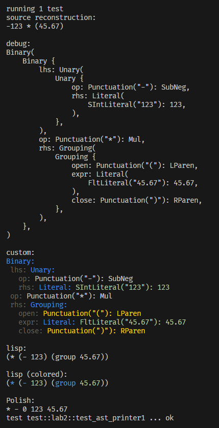
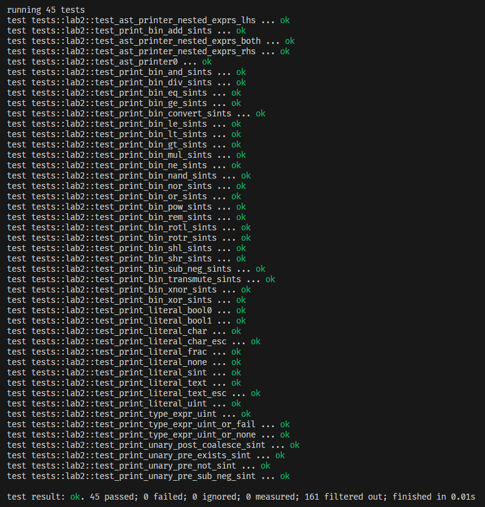
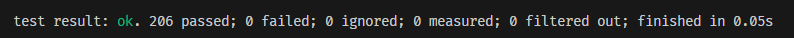

# AST Printer

## Syntactic Grammar Design

```text
expression -> or ;
or -> xor ( ("|" | "!|") xor )* ;
xor -> and ( ("^" | "!^") and )* ;
and -> equality ( ("&" | "!&") equality )* ;
equality -> comparison ( ("!=" | "==") comparison )* ;
comparison -> shift ( ( ">" | ">=" | "<" | "<=" ) shift )* ;
shift -> term ( ( "<<" | ">>" | "[<<]" | "[>>]" ) term )* ;
term -> factor ( ( "+" | "-" ) factor )* ;
factor -> unary_postfix ( ( "*" | "/" | "%" ) unary_postfix )* ;
unary_postfix -> unary_prefix ( "?" )* ;
unary_prefix -> ( ( "!" | "!!" | "-" ) exponent )* ;
exponent -> fn_call_or_conversion ( "**" fn_call_or_conversion )* ;
fn_call_or_conversion -> fn_call | conversion ;
conversion -> primary ( "-:>" | "=:>" ) type_expression ;
primary -> literal | group ;
literal -> "true" | "fals" | "none" | UINT | SINT | FRAC | CHAR | TEXT ;
group -> "(" expression ")" ;
type_expression -> ( "nevr" | "bool" | "uint" | "sint" | "frac" | "char" | "text" | "fail" | IDENTIFIER ) ( "|" ( "fail" | "none" | "nevr" ) )? ;
```

UNDER CONSTRUCTION:

```text
fn_source -> IDENTIFIER | group ;
arg_list1 -> ( "," expression )* ;
arg_list -> expression ( arg_list1 )* ( "," )? ;
fn_call -> fn_source "(" ( expr ( "," expr )* ( "," )? )? ")" ;
```

### Supported Operators

#### Binary

- `And` - `&`: Contextually acts as either bitwise or logical, depending on its operands' types.
- `Xor` - `^`: Contextually acts as either bitwise or logical, depending on its operands' types.
- `Or` - `|`: Contextually acts as either bitwise or logical, depending on its operands' types.
- `Nand` - `!&`: Contextually acts as either bitwise or logical, depending on its operands' types.
- `Xnor` - `!^`: Contextually acts as either bitwise or logical, depending on its operands' types.
- `Nor` - `!|`: Contextually acts as either bitwise or logical, depending on its operands' types.
- `Add` - `+`: Adds its operands, or concatenates them if either is a string. String concatenation does not receive any special treatment in terms of operator precedence/associativity, so `"x" + 5 + 6` will produce `"x56"` while `5 + 6 + "x"` will produce `"11x"`.
- `SubNeg` - `-`: Subtracts its operands
- `Mul` - `*`: Multiplies its operands
- `Div` - `/`: Divides the left operand by the right operand
- `Rem` - `%`: Performs the remainder operation between the left and right operands
- `Pow` - `**`: Puts the left operand to the power of the right operand
- `Shl` - `<<`: Left-bitshifts the left operand by a number of bits equal to the right operand
- `Shr` - `>>`: Right-bitshifts the left operand by a number of bits equal to the right operand
- `Rotl` - `[<<]`: Left-bitrotates the left operand by a number of bits equal to the right operand
- `Rotr` - `[>>]`: Right-bitrotates the left operand by a number of bits equal to the right operand
- `Convert` - `-:>`:
  Takes a value expression on the left and a type expression on the right. If the conversion between the left hand type and the right hand type is fallible (e.g. sint -:> uint, since negatives cannot convert to unsigned), the type expression must include an "or type". Specifically, `none`, `fail`, or `nevr`.

  `none` is both a value and a type. `Foo | none` indicates the conversion should produce a null in the case of failure.
  `fail` is a type and a control keyword. `Foo | fail` indicates conversion should raise an exception in the case of failure.
  `nevr` is purely a type. `Foo | nevr` indicates that conversion will never fail. If the conversion DOES fail, the application may either raise an exception or perform undefined behavior, depending on whether it is running in debug or release.
- `Transmute` - `=:>`:
  Takes a value expression on the left and a type expression on the right.
- Comparisons
  - `Ne` - `!=`
  - `Eq` - `==`
  - `Lt` - `<`
  - `Gt` - `>`
  - `Le` - `<=`
  - `Ge` - `>=`

#### Unary Prefix

- `Not` - `!`: Contextually acts as either bitwise or logical, depending on its operands' types.
- `SubNeg` - `-`: Arithmetically negates its operand.
- `Exists` - `!!`:
  - For `none`: always returns false.
  - For a boolean: returns the value of the boolean.
  - For a floating point: returns true if the float is anything except for `NaN`.
  - For a character: returns true if the character is anything except for `'\0'`.
  - For a string: returns true if the string is non-empty.
  - For anything else: always returns true.

#### Unary Postfix

- `Coalesce` - `?`: If its operand is `none`, the entire expression evaluates to `none`. Otherwise, simply forwards its operand.

### Supported Literal Types

- `BoolLiteral` (`true` or `fals` (the "e" is removed from "false" so it has the same number of columns as "true"))
- `UIntLiteral` - unsigned integer
- `SIntLiteral` - signed integer
- `FracLiteral` - floating point
- `CharLiteral` - character
- `TextLiteral` - string
- `Keyword` - specifically `none`

## AST Printing

There are currently ~3 implementations for printing the AST:

1. [`print_ast`](/src/main.rs) function: recursively calls itself with incrementing indentation depth & bracket depth
2. [`LispDisplay`](/src/grammar/mod.rs) trait: prints nodes in Lisp style
3. Rust's builtin `Debug` derive (I didn't write this, it just comes with Rust, so I'm not counting it)

### Examples

Hard-coded AST in Rust code:

```rs
Expr::binary(Binary {
    lhs: Expr::unary(Unary {
        op: Token {
            lex: "-",
            val: LexValue::Punctuation(Punctuation::SubNeg),
            mac: None,
        },
        rhs: Expr::Literal(Token {
            lex: "123",
            val: LexValue::SIntLiteral(123),
            mac: None,
        }),
    }),
    op: Token {
        lex: "*",
        val: LexValue::Punctuation(Punctuation::Mul),
        mac: None,
    },
    rhs: Expr::grouping(Grouping {
        open: Token {
            lex: "(",
            val: LexValue::Punctuation(Punctuation::LParen),
            mac: None,
        },
        expr: Expr::literal(Token {
            lex: "45.67",
            val: LexValue::FracLiteral(45.67),
            mac: None,
        }),
        close: Token {
            lex: ")",
            val: LexValue::Punctuation(Punctuation::RParen),
            mac: None,
        },
    }),
})
```

`Display`:

```text
-123 * (45.67)
```

`Debug`:

```text
Binary(
    Binary {
        lhs: Unary(
            Unary {
                op: Punctuation("-"): SubNeg,
                rhs: Literal(
                    SIntLiteral("123"): 123,
                ),
            },
        ),
        op: Punctuation("*"): Mul,
        rhs: Grouping(
            Grouping {
                open: Punctuation("("): LParen,
                expr: Literal(
                    FltLiteral("45.67"): 45.67,
                ),
                close: Punctuation(")"): RParen,
            },
        ),
    },
)
```

`print_ast`:

```text
Binary:
 lhs: Unary:
   op: Punctuation("-"): SubNeg
   rhs: Literal: SIntLiteral("123"): 123
 op: Punctuation("*"): Mul
 rhs: Grouping:
   open: Punctuation("("): LParen
   expr: Literal: FltLiteral("45.67"): 45.67
   close: Punctuation(")"): RParen
```

`LispDisplay`:

```lisp
(* (- 123) (group 45.67))
```

Image:



## Tests

These tests are performed by printing to a string, instead of to the command line, and then testing string equality between the expected output and the actual output.

For simplicity, only the un-colorized Lisp representations have unit tests (colored/indented text is harder to write expected outputs for).

**Note:** AST structures in these tests have been simplified using macros, since they can get quite large.

For example:

```rs
syntax_tree!(
    Binary(
        Unary(Token(Punctuation::SubNeg), Literal(SIntLiteral(123))),
        Token(Punctuation::Mul),
        Grouping(Literal(FracLiteral(45.67))),
    )
)
```

if written by hand without the `syntax_tree` macro, would look like this:

```rs
Expr::Binary(Box::new(
    Binary {
        lhs: Expr::Unary(Box::new(Unary {
            op: Token {
                lex: "-",
                val: LexValue::Punctuation(Punctuation::SubNeg),
                mac: None,
            },
            operand: Expr::Literal(Token {
                lex: "123",
                val: LexValue::SIntLiteral(123),
                mac: None,
            }),
            side: OpSide::Right,
        })),
        op: Token {
            lex: "*",
            val: LexValue::Punctuation(Punctuation::Mul),
            mac: None,
        },
        rhs: Expr::Grouping(Box::new(Grouping {
            open: Token {
                lex: "(",
                val: LexValue::Punctuation(Punctuation::LParen),
                mac: None,
            },
            expr: Expr::Literal(Token {
                lex: "45.67",
                val: LexValue::FracLiteral(45.67),
                mac: None,
            }),
            close: Token {
                lex: ")",
                val: LexValue::Punctuation(Punctuation::RParen),
                mac: None,
            },
        })),
    },
))
```

I hope you can excuse my structures being more terse in this description than they might be without shorthands.

Assume that all of the following tests are passing unless stated otherwise.
The tests themselves can be found in [`src/tests/lab2.rs`](/src/tests/lab2.rs).

- `test_ast_printer0`
  - Purpose: Check the Lisp representation of the expression provided in the instructions.
  - Expected Output: `(* (- 123) (group 45.67))`
  - AST:

  ```rs
  Binary(
      Unary(Token(Punctuation::SubNeg), Literal(SIntLiteral(123))),
      Token(Punctuation::Mul),
      Grouping(Literal(FracLiteral(45.67))),
  )
  ```

- `test_ast_printer_nested_exprs_rhs`
  - Purpose: Lisp can represent nested binary expressions, at least on the right hand side
  - Expected Output: `(+ 1 (+ 2 3))`
  - AST:

  ```rs
  Binary(
      Literal(SIntLiteral(1)),
      Token(Punctuation::Add),
      Binary(
          Literal(SIntLiteral(2)),
          Token(Punctuation::Add),
          Literal(SIntLiteral(3)),
      ),
  )
  ```

- `test_ast_printer_nested_exprs_lhs`
  - Purpose: Lisp can represent nested binary expressions, at least on the left hand side
  - Expected Output: `(+ (+ 1 2) 3)`
  - AST:

  ```rs
  Binary(
      Binary(
          Literal(SIntLiteral(1)),
          Token(Punctuation::Add),
          Literal(SIntLiteral(2)),
      ),
      Token(Punctuation::Add),
      Literal(SIntLiteral(3)),
  )
  ```

- `test_ast_printer_nested_exprs_both`
  - Purpose: Lisp can represent nested binary expressions, on both sides
  - Expected Output: `(+ (+ 1 2) (+ 3 4))`
  - AST:

  ```rs
  Binary(
      Binary(
          Literal(SIntLiteral(1)),
          Token(Punctuation::Add),
          Literal(SIntLiteral(2)),
      ),
      Token(Punctuation::Add),
      Binary(
          Literal(SIntLiteral(3)),
          Token(Punctuation::Add),
          Literal(SIntLiteral(4)),
      ),
  )
  ```

- `test_print_bin_and_sints`
  - Purpose: Test the Lisp representation of the binary "And" operator
  - Expected Output: `(& 1 2)`
  - AST:

  ```rs
  Binary(
    Literal(SIntLiteral(1)),
    Token(Punctuation::And),
    Literal(SIntLiteral(2)),
  )
  ```

- `test_print_bin_xor_sints`
  - Purpose: Test the Lisp representation of the binary "Xor" operator
  - Expected Output: `(^ 1 2)`
  - AST:

  ```rs
  Binary(
    Literal(SIntLiteral(1)),
    Token(Punctuation::Xor),
    Literal(SIntLiteral(2)),
  )
  ```

- `test_print_bin_or_sints`
  - Purpose: Test the Lisp representation of the binary "Or" operator
  - Expected Output: `(| 1 2)`
  - AST:

  ```rs
  Binary(
    Literal(SIntLiteral(1)),
    Token(Punctuation::Or),
    Literal(SIntLiteral(2)),
  )
  ```

- `test_print_bin_nand_sints`
  - Purpose: Test the Lisp representation of the binary "Nand" operator
  - Expected Output: `(!& 1 2)`
  - AST:

  ```rs
  Binary(
    Literal(SIntLiteral(1)),
    Token(Punctuation::Nand),
    Literal(SIntLiteral(2)),
  )
  ```

- `test_print_bin_xnor_sints`
  - Purpose: Test the Lisp representation of the binary "Xnor" operator
  - Expected Output: `(!^ 1 2)`
  - AST:

  ```rs
  Binary(
    Literal(SIntLiteral(1)),
    Token(Punctuation::Xnor),
    Literal(SIntLiteral(2)),
  )
  ```

- `test_print_bin_nor_sints`
  - Purpose: Test the Lisp representation of the binary "Nor" operator
  - Expected Output: `(!| 1 2)`
  - AST:

  ```rs
  Binary(
    Literal(SIntLiteral(1)),
    Token(Punctuation::Nor),
    Literal(SIntLiteral(2)),
  )
  ```

- `test_print_bin_add_sints`
  - Purpose: Test the Lisp representation of the binary "Add" operator
  - Expected Output: `(+ 1 2)`
  - AST:

  ```rs
  Binary(
    Literal(SIntLiteral(1)),
    Token(Punctuation::Add),
    Literal(SIntLiteral(2)),
  )
  ```

- `test_print_bin_sub_neg_sints`
  - Purpose: Test the Lisp representation of the binary "SubNeg" operator
  - Expected Output: `(- 1 2)`
  - AST:

  ```rs
  Binary(
    Literal(SIntLiteral(1)),
    Token(Punctuation::SubNeg),
    Literal(SIntLiteral(2)),
  )
  ```

- `test_print_bin_mul_sints`
  - Purpose: Test the Lisp representation of the binary "Mul" operator
  - Expected Output: `(* 1 2)`
  - AST:

  ```rs
  Binary(
    Literal(SIntLiteral(1)),
    Token(Punctuation::Mul),
    Literal(SIntLiteral(2)),
  )
  ```

- `test_print_bin_div_sints`
  - Purpose: Test the Lisp representation of the binary "Div" operator
  - Expected Output: `(/ 1 2)`
  - AST:

  ```rs
  Binary(
    Literal(SIntLiteral(1)),
    Token(Punctuation::Div),
    Literal(SIntLiteral(2)),
  )
  ```

- `test_print_bin_rem_sints`
  - Purpose: Test the Lisp representation of the binary "Rem" operator
  - Expected Output: `(% 1 2)`
  - AST:

  ```rs
  Binary(
    Literal(SIntLiteral(1)),
    Token(Punctuation::Rem),
    Literal(SIntLiteral(2)),
  )
  ```

- `test_print_bin_pow_sints`
  - Purpose: Test the Lisp representation of the binary "Pow" operator
  - Expected Output: `(** 1 2)`
  - AST:

  ```rs
  Binary(
    Literal(SIntLiteral(1)),
    Token(Punctuation::Pow),
    Literal(SIntLiteral(2)),
  )
  ```

- `test_print_bin_shl_sints`
  - Purpose: Test the Lisp representation of the binary "Shl" operator
  - Expected Output: `(<< 1 2)`
  - AST:

  ```rs
  Binary(
    Literal(SIntLiteral(1)),
    Token(Punctuation::Shl),
    Literal(SIntLiteral(2)),
  )
  ```

- `test_print_bin_shr_sints`
  - Purpose: Test the Lisp representation of the binary "Shr" operator
  - Expected Output: `(>> 1 2)`
  - AST:

  ```rs
  Binary(
    Literal(SIntLiteral(1)),
    Token(Punctuation::Shr),
    Literal(SIntLiteral(2)),
  )
  ```

- `test_print_bin_rotl_sints`
  - Purpose: Test the Lisp representation of the binary "Rotl" operator
  - Expected Output: `([<<] 1 2)`
  - AST:

  ```rs
  Binary(
    Literal(SIntLiteral(1)),
    Token(Punctuation::Rotl),
    Literal(SIntLiteral(2)),
  )
  ```

- `test_print_bin_rotr_sints`
  - Purpose: Test the Lisp representation of the binary "Rotr" operator
  - Expected Output: `([>>] 1 2)`
  - AST:

  ```rs
  Binary(
    Literal(SIntLiteral(1)),
    Token(Punctuation::Rotr),
    Literal(SIntLiteral(2)),
  )
  ```

- `test_print_bin_convert_sints`
  - Purpose: Test the Lisp representation of the binary "Convert" operator
  - Expected Output: `(-:> 1 2)`
  - AST:

  ```rs
  Binary(
    Literal(SIntLiteral(1)),
    Token(Punctuation::Convert),
    Literal(SIntLiteral(2)),
  )
  ```

- `test_print_bin_transmute_sints`
  - Purpose: Test the Lisp representation of the binary "Transmute" operator
  - Expected Output: `(=:> 1 2)`
  - AST:

  ```rs
  Binary(
    Literal(SIntLiteral(1)),
    Token(Punctuation::Transmute),
    Literal(SIntLiteral(2)),
  )
  ```

- `test_print_bin_eq_sints`
  - Purpose: Test the Lisp representation of the binary "Eq" operator
  - Expected Output: `(== 1 2)`
  - AST:

  ```rs
  Binary(
    Literal(SIntLiteral(1)),
    Token(Punctuation::Eq),
    Literal(SIntLiteral(2)),
  )
  ```

- `test_print_bin_ne_sints`
  - Purpose: Test the Lisp representation of the binary "Ne" operator
  - Expected Output: `(!= 1 2)`
  - AST:

  ```rs
  Binary(
    Literal(SIntLiteral(1)),
    Token(Punctuation::Ne),
    Literal(SIntLiteral(2)),
  )
  ```

- `test_print_bin_lt_sints`
  - Purpose: Test the Lisp representation of the binary "Lt" operator
  - Expected Output: `(< 1 2)`
  - AST:

  ```rs
  Binary(
    Literal(SIntLiteral(1)),
    Token(Punctuation::Lt),
    Literal(SIntLiteral(2)),
  )
  ```

- `test_print_bin_gt_sints`
  - Purpose: Test the Lisp representation of the binary "Gt" operator
  - Expected Output: `(> 1 2)`
  - AST:

  ```rs
  Binary(
    Literal(SIntLiteral(1)),
    Token(Punctuation::Gt),
    Literal(SIntLiteral(2)),
  )
  ```

- `test_print_bin_le_sints`
  - Purpose: Test the Lisp representation of the binary "Le" operator
  - Expected Output: `(<= 1 2)`
  - AST:

  ```rs
  Binary(
    Literal(SIntLiteral(1)),
    Token(Punctuation::Le),
    Literal(SIntLiteral(2)),
  )
  ```

- `test_print_bin_ge_sints`
  - Purpose: Test the Lisp representation of the binary "Ge" operator
  - Expected Output: `(>= 1 2)`
  - AST:

  ```rs
  Binary(
    Literal(SIntLiteral(1)),
    Token(Punctuation::Ge),
    Literal(SIntLiteral(2)),
  )
  ```

- `test_print_unary_pre_not_sint`
  - Purpose: Test the Lisp representation of the unary prefix "Not" operator
  - Expected Output: `(! 1)`
  - AST:

  ```rs
  Unary(
    Token(Punctuation::Not),
    Literal(SIntLiteral(1)),
  )
  ```

- `test_print_unary_pre_sub_neg_sint`
  - Purpose: Test the Lisp representation of the unary prefix "SubNeg" operator
  - Expected Output: `(- 1)`
  - AST:

  ```rs
  Unary(
    Token(Punctuation::SubNeg),
    Literal(SIntLiteral(1)),
  )
  ```

- `test_print_unary_pre_exists_sint`
  - Purpose: Test the Lisp representation of the unary prefix "Exists" operator
  - Expected Output: `(!! 1)`
  - AST:

  ```rs
  Unary(
    Token(Punctuation::Exists),
    Literal(SIntLiteral(1)),
  )
  ```

- `test_print_unary_post_coalesce_sint`
  - Purpose: Test the Lisp representation of the unary postfix "Coalesce" operator
  - Expected Output: `(? 1)`
  - AST:

  ```rs
  Unary(
    Literal(SIntLiteral(1)),
    Token(Punctuation::Coalesce),
  )
  ```

- `test_print_type_expr_uint`
  - Purpose: Test the Lisp representation of the "Uint"-keyword type expression
  - Expected Output: `uint`
  - AST:

  ```rs
  Type(Token(Keyword::Uint))
  ```

- `test_print_type_expr_uint_or_none`
  - Purpose Test the Lisp representation of the "Uint or None" type expression
  - Expected Output: `(| uint none)`
  - AST:

  ```rs
  Type(
      Token(Keyword::Uint),
      Token(Punctuation::Or),
      Token(Keyword::None),
  )
  ```

- `test_print_type_expr_uint_or_fail`
  - Purpose Test the Lisp representation of the "Uint or Fail" type expression
  - Expected Output: `(| uint fail)`
  - AST:

  ```rs
  Type(
      Token(Keyword::Uint),
      Token(Punctuation::Or),
      Token(Keyword::Fail),
  )
  ```

- `test_print_literal_bool0`
  - Purpose: Test the Lisp representation of the boolean literal "true"
  - Expected Output: `true`
  - AST:

  ```rs
  Literal(BoolLiteral(true))
  ```

- `test_print_literal_bool1`
  - Purpose: Test the Lisp representation of the boolean literal "false"
  - Expected Output: `false`
  - AST:

  ```rs
  Literal(BoolLiteral(false))
  ```

- `test_print_literal_none`
  - Purpose: Test the Lisp representation of the "none" keyword
  - Expected Output: `none`
  - AST:

  ```rs
  Literal(Keyword::None)
  ```

- `test_print_literal_sint`
  - Purpose: Test the Lisp representation of a signed integer literal
  - Expected Output: `-53`
  - AST:

  ```rs
  Literal(SIntLiteral(-53))
  ```

- `test_print_literal_uint`
  - Purpose: Test the Lisp representation of an unsigned integer literal
  - Expected Output: `78`
  - AST:

  ```rs
  Literal(SIntLiteral(78))
  ```

- `test_print_literal_frac`
  - Purpose: Test the Lisp representation of a floating point literal
  - Expected Output: `54.87`
  - AST:

  ```rs
  Literal(FracLiteral(54.87))
  ```

- `test_print_literal_char`
  - Purpose: Test the Lisp representation of a character literal (without escapes)
  - Expected Output: `'x'`
  - AST:

  ```rs
  Literal(CharLiteral('x', false))
  ```

- `test_print_literal_char_esc`
  - Purpose: Test the Lisp representation of a character literal (with escapes)
  - Expected Output: `'\x1b'`
  - AST:

  ```rs
  Literal(CharLiteral('\x1b', true))
  ```

- `test_print_literal_text`
  - Purpose: Test the Lisp representation of a string literal (without escapes)
  - Expected Output: `"apple"`
  - AST:

  ```rs
  Literal(TextLiteral("apple"))
  ```

- `test_print_literal_text_esc`
  - Purpose: Test the Lisp representation of a string literal (with escapes)
  - Expected Output: `"I \"bought\" an apple"`
  - AST:

  ```rs
  Literal(TextLiteral("I \"bought\" an apple"))
  ```



### Steps to Reproduce

With `rustc 1.100.0-nightly (6bb1652a0 2026-09-22)` or newer installed (you can check/update `rustc` using `rustup --version` or `rustup upgrade` respectively), enter the project directory (the directory containing [Cargo.toml](/Cargo.toml)). Then, run the command `cargo test lab2` to run all lab2 tests.

You can also run `cargo test` to run **all** unit tests, not just the ones for lab 2. As of writing, there are 206 total unit tests, and all of them pass.


